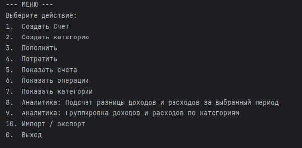
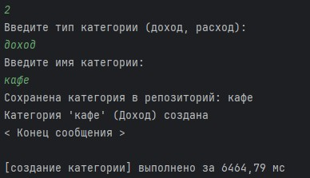

## ТигрБанк — Учёт личных финансов

Консольное приложение для анализа доходов и расходов с поддержкой категоризации, аналитики и
импорта/экспорта данных.

Version 1.2.0

Добавление паттернов проектирования:

- Фабрика
- Фасад
- Команда
- Шаблон

<div>
  
  
</div>  

### Предметная область

Приложение моделирует систему учёта личных финансов с тремя ключевыми сущностями:

| Сущность      | Назначение                        | Примеры                                 |
|---------------|-----------------------------------|-----------------------------------------|
| `BankAccount` | Финансовый счёт пользователя      | «Основной», «Сберегательный»            |
| `Category`    | Категория операций (доход/расход) | «Зарплата» (доход), «Продукты» (расход) |
| `Operation`   | Финансовая операция               | Пополнение счёта на 50 000 ₽            |  

### Функциональность

- Создание/редактирование/удаление счетов, категорий, операций
- Аналитика:
    - Разница доходов/расходов за период
    - Группировка операций по категориям
- Импорт/экспорт данных в форматах **JSON, YAML, CSV**
- Измерение времени выполнения операций (мс)

### Code style

В проекте применен Google Java Code style

### Паттерн Фабричный метод

В проекте применено создание экземпляров следующих классов при помощи Фабричного метода:

- Category - сделана фабрика и создатель (Creator) в зависимости от типа категории (доход, расход).
- Operation - фабрика и creator.
- Command - фабрика при помощи аннотации @FunctionalInterface.

### Паттерн Фасад

В проекте применен паттерн Фасад для облегчения взаимодействия нескольких сущностей. Фасад применен
в сервисе ImportExport и GeneralService.

### Паттерн Команда

Паттерн команда применен в пакете Interaction для отработки пользовательских действий  
(взаимодействие пользователя с меню) - каждая команда, вызываемая пользователем, имеет метод
execute().
Команды создаются в "ленивой" фабрике.

### Паттерн Шаблонный метод

Паттерн Шаблонный метод применен в пакете ImportExport для унифицированного использования разных
форматов данных для импорта и экспорта.

## Архитектура и принципы SOLID

### Принцип единственной ответственности (SRP)

Каждый класс отвечает за одну задачу:

```java
// BankAccount — только управление балансом
public final class BankAccount extends Account implements Depositable, Withdrawable {

  @Override
  public void deposit(long amount) {
    this.balance += amount;
  }

  @Override
  public void withdraw(long amount) {
    this.balance -= amount;
  }
}

// MoneyGroup — только агрегация по категориям
public class MoneyGroup implements Calculatable {

  @Override
  public void calculate() {
    // группировка операций 
  }
}
```

### Принцип открытости/закрытости (OCP)

Добавление новых форматов экспорта без изменения существующего кода:

```java
// Новый формат добавляется через реализацию интерфейса
@Component
public class XmlFormat implements DataFormat { /* ... */

}

// Без изменения существующего сервиса:
@Service
public class ImportExportService {

  // Внедряются все реализации через коллекцию
  public ImportExportService(List<DataFormat> formats) { /* ... */ }
}
```

### Принцип инверсии зависимостей (DIP)

Зависимости от абстракций, а не от конкретных реализаций:

```java
// Вместо прямой зависимости от OperationRepository
@Service
public class GeneralService {

  private final BaseRepository<Operation> operationRepository; // ← абстракция

  @Autowired
  public GeneralService(BaseRepository<Operation> repo) {
    this.operationRepository = repo;
  }
}
```

### DI-контейнер (Spring)

Все зависимости управляются через контейнер Spring:

```java

@SpringBootApplication
public class TigerBankApplication {

  public static void main(String[] args) {
    // Контекст создаёт и связывает все компоненты
    ConfigurableApplicationContext context =
        SpringApplication.run(TigerBankApplication.class, args);

    // Interaction получает все зависимости автоматически:
    // - Logger, GeneralService, Scanner, ImportExportService
    Interaction interaction = context.getBean(Interaction.class);
    interaction.runMenu();
  }
}
```

**Преимущества:**

- Автоматическое управление жизненным циклом объектов
- Лёгкое тестирование через подмену зависимостей (если использовать мок-тестирование)
- Чёткое разделение ответственностей между слоями

### Принципы GRASP

В проекте использован принцип Низкая связанность (Low Coupling) и Высокое зацепление (High
Cohesion).  
Сущности, размещенные в соответствующих пакетах, тесно взаимодействуют только на необходимом уровне,
а на уровне слоев сами сущности связаны слабо и могу быть заменены на другие.

### Модульное тестирование

Покрытие критических сценариев доменной логики - созданы тесты для доменных классов.  
Для запуска тестов:

```java
./gradlew test
jacocoTestReport
```

Отчёт: build/reports/jacoco/test/html/index.html

### Импорт/экспорт данных

Поддержка трёх форматов через единый интерфейс:

```java
public interface DataFormat {

  void export(BankDataDTO data, Path filePath) throws IOException;

  BankDataDTO importData(Path filePath) throws IOException;

  String getFileExtension();
}
```

### Измерение производительности

Время выполнения операций выводится автоматически при любой операции в консоли:

```java
[пополнение]3.24мс
```

### Почему архитектурные решения улучшили дизайн

1. Интерфейс Calculatable  
   Позволяет добавлять новые типы аналитики без изменения ядра:

```java
public interface Calculatable {

  void calculate();
} 
```

2. Единый интерфейс DataFormat  
   Новые форматы (XML, Protobuf) добавляются без изменения ImportExportService.

3. Репозитории через BaseRepository<T>
   Единая логика хранения для всех сущностей с возможностью замены реализации (БД → файлы).

4. Валидация в конструкторах доменных классов
   Гарантирует неизменяемость и корректность состояния на уровне модели, а не сервисов.

### Ситуации, при которых появятся проблемы добавления нового функционала или расширении бизнес-логики

- Необходимость добавления операций расчета скорости выполнения процедур;
- Сложность реализации вывода информации в output различных типов, а также в консоль (не до конца
  реализовано применение интерфейса Printable пакета Presentation);
- Возможность напрямую изменять объекты доменных классов через геттеры репозиториев;
- Имеется зависимость не от абстракций, а конкретных классов.

### Сборка и запуск

Требования

- JDK 21+
- Gradle 8.9+

```bash
#Сборка проекта
./gradlew build

#Запуск приложения
./gradlew bootRun

#Запуск тестов + отчёт покрытия
./gradlew test jacocoTestReport
```

**Также можно запустить проект из собранного jar архива (в папке app_jar).**

### Структура проекта

```bash
└───src  
├───main  
│   └───java  
│       └───TigerBank  
│           ├───Analytics  
│           ├───Config  
│           ├───Domain  
│           │   ├───Account  
│           │   ├───Category  
│           │   ├───Identifiable  
│           │   ├───Operation  
│           │   └───TxType  
│           ├───ImportExport  
│           ├───Interaction  
│           ├───Presentation  
│           ├───Repository  
│           ├───Service  
│           └───Utils  
│               ├───IDGenerator  
│               ├───Logging  
│               └───Stopwatch  
└───test  
└───java  
└───TigerBank  
└───Domain  
├───Account  
├───Category  
├───Operation  
└───TxType  
```

### Автор: Anton Evgenev. tg: @tdutanton